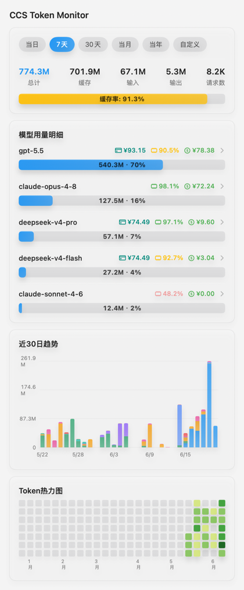
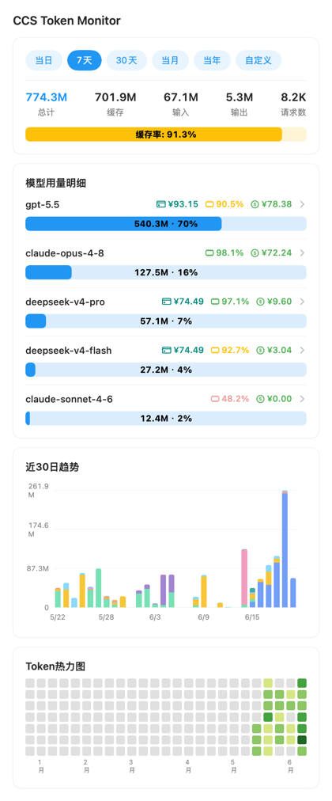
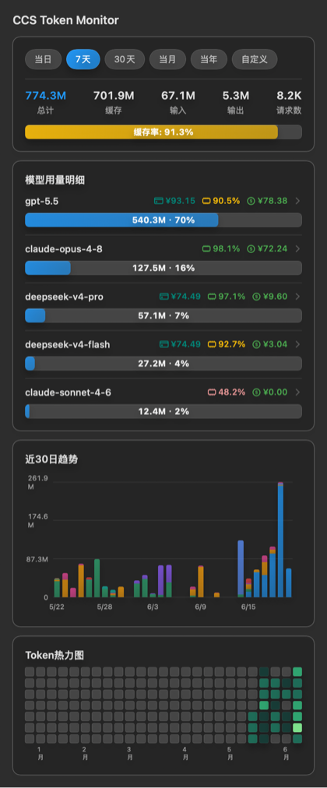
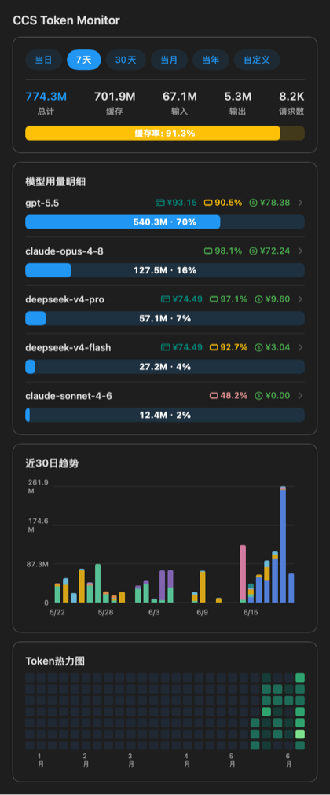
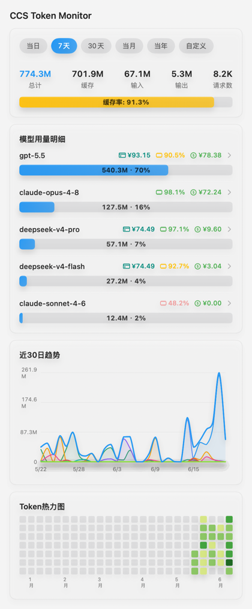
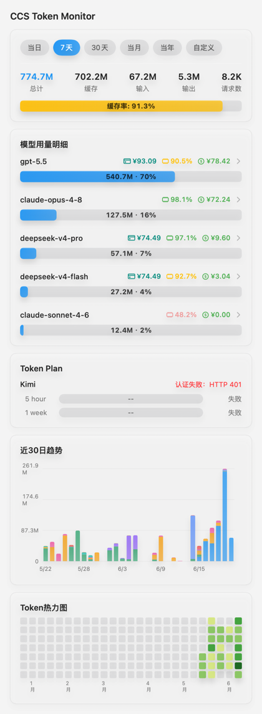

# cc-switch monitor

macOS 菜单栏应用，从 `~/.cc-switch/cc-switch.db` 只读读取 token 用量并可视化。

## 界面预览

| 浅色 · 毛玻璃 | 浅色 · 实色 |
| --- | --- |
|  |  |

| 深色 · 毛玻璃 | 深色 · 实色 |
| --- | --- |
|  |  |

| 折线图趋势 | Token Plan |
| --- | --- |
|  |  |

## 功能

- **菜单栏今日 Token**：菜单栏直接显示当日总 Token，点击打开完整面板。
- **总 Token 汇总**：按当日 / 7 天 / 30 天 / 当月 / 当年 / 自定义时间范围展示总计、缓存、输入、输出、请求数和缓存率。
- **模型用量明细**：展示当前时间范围内 Top N 模型的 Token 占比、缓存率、消费和余额；可在设置中选择展示 1-10 个模型，并按总 Token、输入、输出、缓存、缓存率、请求数或消费排序；点击模型行可展开总计 / 缓存 / 输入 / 输出 / 请求数明细。
- **Token Plan 额度**：支持在设置中分别启用 Kimi、智谱、MiniMax Token Plan，只需填写 API Key；首页随整体刷新展示 5 hour / 1 week 额度、使用率和剩余刷新时间。
- **最近 30 天趋势**：支持柱状图 / 折线图两种展示模式，按天展示各模型用量；折线图会额外展示总量曲线，鼠标悬停可查看某天的模型明细和总量。
- **Token 活动热力图**：展示本年度每日总 Token，可在设置中选择完整适配或横向滚动。
- **价格与余额**：支持为每个模型配置输入 / 输出 / 缓存读 / 缓存写单价，并绑定 DeepSeek 内置余额、自定义 Python 脚本或 JS 查询模板。
- **外观与背景**：支持跟随系统、浅色、深色三种外观模式，可从标题栏快速切换；背景样式支持实色和毛玻璃。
- **截图导出**：标题栏一键保存完整统计面板长图，保存目录可在设置中配置。
- **显示与行为设置**：支持手动刷新、自动刷新倒计时、5 / 15 / 30 分钟刷新间隔，以及登录 macOS 后自动启动。
- **数据源与诊断**：支持配置 cc-switch SQLite 数据库路径；运行日志可在设置中打开或定位，便于排查数据库读取、余额和 Token Plan 查询问题。

## 数据说明

- 应用默认以**只读**方式访问 `~/.cc-switch/cc-switch.db`，也可在设置中选择其他 cc-switch SQLite 数据库；单价、余额规则（DeepSeek / Python / JS）、Token Plan API Key 和界面设置存于 app 自己的 `UserDefaults`。
- 总 Token 口径与 cc-switch 保持一致：`app_type IN ('codex', 'gemini')` 时会先从 `input_tokens` 扣除 `cache_read_tokens` 得到未命中输入；总量为 `未命中输入 + output + cache_read + cache_create`。
- 汇总和模型明细中的“输入”展示为 `未命中输入 + 缓存写`；菜单栏数字固定展示当日总 Token，不跟随面板顶部时间范围切换。
- 请求数按同一时间范围统计 `proxy_request_logs` 记录数；模型明细中按 `model` 分组统计。
- 缓存率 = `缓存读 / (未命中输入 + 缓存写 + 缓存读)`。
- 聚合查询读取 `proxy_request_logs` 中指定时间范围内的记录，不按 `data_source` 或供应商分组。
- Token Plan 查询使用内置供应商端点（Kimi、智谱、MiniMax），不从 `cc-switch.db` 读取 API Key。

## 安装

1. 从 [GitHub Releases](https://github.com/ShareLer/ccs-token-monitor/releases) 下载 `ccMonitor-*-macOS.zip` 和对应的 `.sha256` 文件。
2. 将两个文件放在同一目录，执行 `shasum -a 256 -c ccMonitor-*-macOS.zip.sha256` 校验下载内容。
3. 解压 zip，将 `ccMonitor.app` 移动到“应用程序”。
4. 打开终端执行：

   ```bash
   xattr -cr "/Applications/ccMonitor.app"
   ```

5. 从“应用程序”打开 `ccMonitor.app`。

`xattr -cr` 用于移除下载文件的隔离属性。

## 开发者开发

### 环境要求

- macOS 13.0+
- Xcode 26
- [XcodeGen](https://github.com/yonsm/XcodeGen)：`brew install xcodegen`

### 构建与运行

```bash
./build.sh Debug
open ./build/Build/Products/Debug/ccMonitor.app
```

构建 Release：`./build.sh Release`。

### Xcode 开发与预览

```bash
xcodegen generate
open ccMonitor.xcodeproj
```

使用 `⌥⌘↩` 打开 SwiftUI Canvas，`⌘R` 运行，`⌘U` 测试。

### 测试

```bash
xcodebuild test -project ccMonitor.xcodeproj -scheme ccMonitor -destination 'platform=macOS'
```

### 发布

```bash
brew install gh
gh auth login
```

1. 更新 `project.yml` 中的 `MARKETING_VERSION` 和 `CURRENT_PROJECT_VERSION`，提交全部改动。
2. 运行 `./release.sh prepare v1.0.6` 准备发布产物。
3. 运行 `git push` 推送当前 commit。
4. 运行 `./release.sh publish v1.0.6 --notes "本版本改动"` 发布。

`prepare` 只生成并校验本地产物；`publish` 校验 commit、tag 和上传资产后创建 GitHub Release。

### 项目结构

```
ccMonitor/
├── ccMonitorApp.swift          # @main 入口
├── AppDelegate.swift           # NSStatusItem + NSPopover
├── Models/                     # 数据模型 + 价格类型
├── Data/                       # SQLite 封装 / 时间窗 / 聚合查询
├── Stores/                     # 设置 / 价格 / 状态中枢（含定时刷新）
└── Views/                      # 主面板 + 各区块视图 + 组件
ccMonitorTests/                 # 单元测试
project.yml                     # XcodeGen 工程声明
build.sh                        # 构建脚本
release.sh                      # GitHub Releases 发布脚本
```
